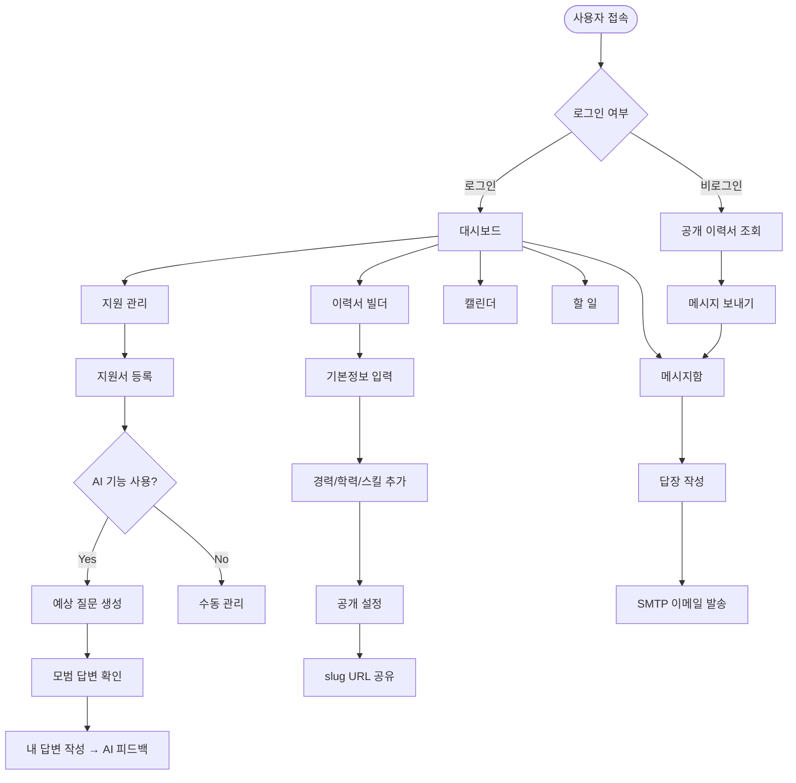
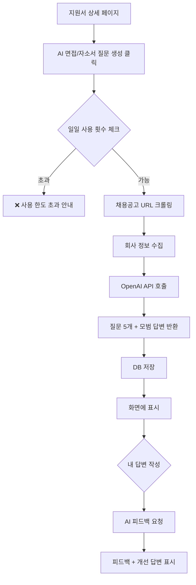
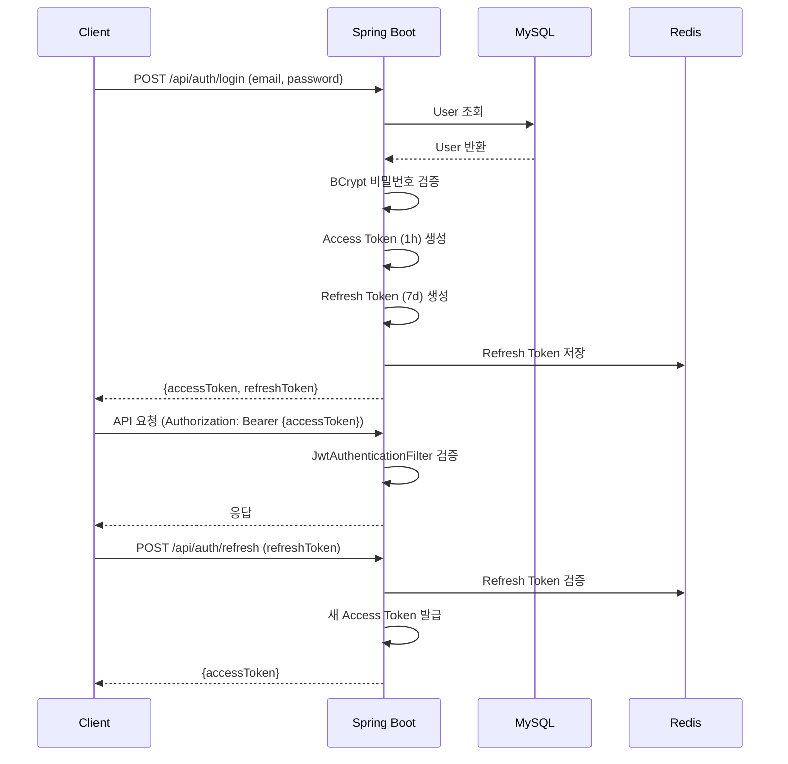
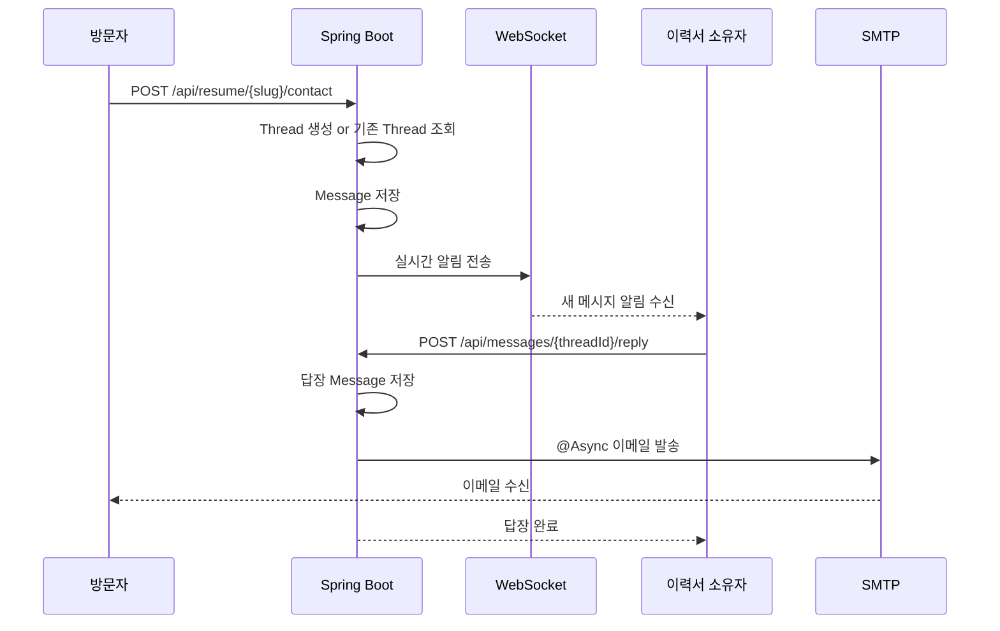
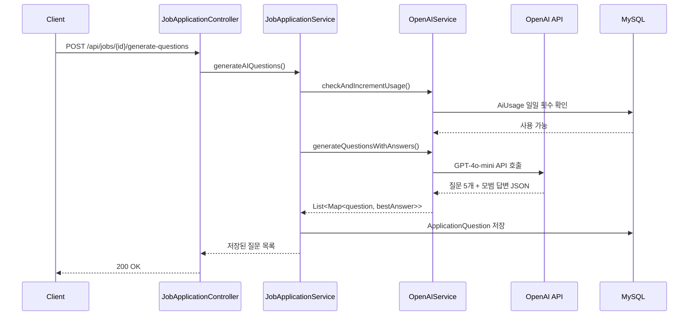

# 🎯 PickMeUp - 취업 준비 통합 관리 플랫폼

> 지원서 관리부터 AI 면접 준비, 이력서 공개까지 - 취업 준비의 모든 것을 한 곳에서

---

## 📌 목차

- [프로젝트 개요](#프로젝트-개요)
- [기술 스택](#기술-스택)
- [시스템 아키텍처](#시스템-아키텍처)
- [서비스 플로우차트](#서비스-플로우차트)
- [시퀀스 다이어그램](#시퀀스-다이어그램)
- [도메인 객체 구조](#도메인-객체-구조)
- [DB 스키마 구조](#db-스키마-구조)
- [브랜치 전략](#브랜치-전략)
- [환경 설정](#환경-설정)
- [실행 방법](#실행-방법)

---

## 프로젝트 개요

PickMeUp은 취업 준비생을 위한 올인원 플랫폼입니다.

| 기능 | 설명 |
|------|------|
| 📋 지원 현황 관리 | 기업별 지원 상태, 일정, 서류 통합 관리 |
| 🤖 AI 면접/자소서 준비 | GPT 기반 예상 질문 및 모범 답변 생성 |
| 📄 이력서 빌더 | 공개 이력서 생성 및 slug URL 공유 |
| 💬 메시지함 | 채용 담당자와의 1:1 메시지 및 이메일 연동 |
| 📅 캘린더 | 면접·과제 일정 통합 관리 |
| ✅ 할 일 관리 | 취업 준비 태스크 트래킹 |
| 🔔 알림 | 웹소켓 실시간 알림 + 카카오/SMS |

---

## 기술 스택

### Backend
| 분류 | 기술 |
|------|------|
| Framework | Spring Boot 3.2.5 (Java 17) |
| ORM | Spring Data JPA + Hibernate |
| Security | Spring Security + JWT |
| Database | MySQL 8.0 |
| Cache | Redis |
| File Upload | Cloudinary |
| 실시간 통신 | WebSocket (STOMP) |
| AI | OpenAI GPT-4o-mini |
| 비동기 처리 | Spring @Async |
| AOP | Spring AOP (Logging, Performance) |

### Frontend
| 분류 | 기술 |
|------|------|
| Framework | React 18 + TypeScript |
| Build | Vite |
| Styling | Tailwind CSS |
| State | Zustand |
| Form | React Hook Form + Zod |
| HTTP | Axios |
| Diagram | Mermaid.js |
| Editor | TipTap |

### Infra
| 분류 | 기술 |
|------|------|
| Container | Docker + Docker Compose |
| CI/CD | Jenkins |
| Reverse Proxy | Nginx |
| Cloud | Oracle Cloud (예정) |

---

## 시스템 아키텍처

```
┌─────────────────────────────────────────────────────┐
│                    Client (Browser)                  │
│                  React + TypeScript                  │
└──────────────────────┬──────────────────────────────┘
                       │ HTTPS / WebSocket
┌──────────────────────▼──────────────────────────────┐
│                    Nginx (Reverse Proxy)              │
│          /api/* → :8080  |  /* → :3000              │
└────────────┬─────────────────────────┬──────────────┘
             │                         │
┌────────────▼──────────┐   ┌──────────▼─────────────┐
│   Spring Boot :8080   │   │   React Static Files   │
│                       │   └────────────────────────┘
│  ┌─────────────────┐  │
│  │   Controller    │  │   External Services
│  │   Service       │  │   ┌──────────────────────┐
│  │   Repository    │  │──▶│  OpenAI API (GPT)    │
│  └────────┬────────┘  │   │  Cloudinary (Upload) │
│           │           │   │  Gmail SMTP          │
└───────────┼───────────┘   └──────────────────────┘
            │
  ┌─────────┼─────────┐
  │         │         │
┌─▼──┐  ┌──▼──┐  ┌───▼──┐
│MySQL│  │Redis│  │(Mongo│
│8.0  │  │     │  │비활성)│
└────┘  └─────┘  └──────┘
```

---

## 서비스 플로우차트

### 전체 사용자 플로우



### AI 질문 생성 플로우



---

## 시퀀스 다이어그램

### JWT 인증 플로우



### 이력서 메시지 수신 플로우



### AI 질문 생성 시퀀스



---

## 도메인 객체 구조

```
com.pickmeup.domain
│
├── user
│   ├── User              # 사용자 (구직자/채용담당자)
│   ├── UserRole          # ROLE_USER, ROLE_ADMIN
│   ├── UserType          # JOB_SEEKER, RECRUITER
│   └── AiUsage           # 일일 AI 사용량 추적
│
├── job
│   ├── JobApplication    # 지원서 (핵심 엔티티)
│   ├── ApplicationStatus # PLANNED→APPLIED→DOCUMENT→INTERVIEW→FINAL→ACCEPTED/REJECTED
│   ├── JobType           # FULL_TIME, PART_TIME, INTERN, CONTRACT
│   ├── ApplicationQuestion   # AI 생성 예상 질문
│   ├── JobApplicationQna     # 자소서 문항 (질문+내용)
│   ├── JobApplicationFile    # 첨부 파일 (Cloudinary)
│   ├── JobApplicationEvent   # 지원 이벤트 히스토리
│   ├── InterviewRecord       # 면접 기록
│   └── AIUsageLog            # AI 사용 로그
│
├── resume
│   ├── Resume            # 이력서 (공개 URL 포함)
│   ├── Experience        # 경력
│   ├── Education         # 학력
│   ├── Project           # 프로젝트
│   ├── Skill             # 기술 스택
│   ├── Certificate       # 자격증
│   ├── Award             # 수상
│   ├── Language          # 어학
│   ├── CoverLetter       # 자기소개서
│   └── PortfolioFile     # 포트폴리오 파일
│
├── message
│   ├── Thread            # 메시지 스레드 (발신자-소유자)
│   ├── Message           # 개별 메시지
│   ├── MessageDirection  # INBOUND(수신) / OUTBOUND(발신)
│   ├── ThreadStatus      # UNREAD, READ, REPLIED
│   └── MessageRaw        # 원본 메시지 + IP/UA 메타데이터
│
├── calendar
│   ├── CalendarEvent     # 일정 (면접, 과제 등)
│   └── RecurrenceType    # NONE, DAILY, WEEKLY, MONTHLY
│
├── task
│   ├── Task              # 할 일
│   ├── TaskStatus        # TODO, IN_PROGRESS, DONE
│   └── TaskPriority      # LOW, MEDIUM, HIGH
│
├── notification
│   ├── NotificationJob   # 발송 예약 작업
│   ├── NotificationLog   # 발송 결과 로그
│   └── NotificationChannel # EMAIL, KAKAO, SMS, WEB_PUSH
│
└── recruiter
    └── ContactProposal   # 채용 담당자 면접 제안
```

**도메인 간 주요 관계:**
```
User ──1:N──▶ JobApplication
User ──1:1──▶ Resume
Resume ──1:N──▶ Experience, Education, Project, Skill ...
JobApplication ──1:N──▶ ApplicationQuestion, JobApplicationQna, InterviewRecord
Thread ──1:N──▶ Message
User(owner) ──1:N──▶ Thread
```

---

## DB 스키마 구조

### 핵심 테이블

```sql
-- 사용자
users
  id, email, password, name, phone, profile_image_url
  user_role, user_type, created_at, updated_at

-- 지원서
job_applications
  id, user_id(FK), company_name, position, job_type
  status, applied_date, deadline
  job_url, job_description, company_info, required_skills
  salary_min, salary_max, location, memo
  created_at, updated_at

-- 지원 예상 질문 (AI 생성)
application_questions
  id, job_application_id(FK), question, best_answer
  my_answer, ai_feedback, question_type(DOCUMENT/INTERVIEW)
  created_at

-- 이력서
resumes
  id, user_id(FK), title, slug(UNIQUE)
  is_public, resume_type, layout_type
  summary, desired_position, desired_salary
  created_at, updated_at

-- 메시지 스레드
threads
  id, owner_id(FK), sender_name, sender_email
  subject, status, message_count
  is_starred, is_archived, created_at

-- 메시지
messages
  id, thread_id(FK), content, direction
  is_read, created_at

-- 캘린더 이벤트
calendar_events
  id, user_id(FK), job_application_id(FK nullable)
  title, description, start_time, end_time
  recurrence_type, created_at

-- 할 일
tasks
  id, user_id(FK), title, description
  status, priority, due_date, created_at

-- AI 일일 사용량
ai_usage
  id, user_id(FK), usage_date
  question_count, feedback_count
```

### 관계도 요약
```
users ──┬──▶ job_applications ──▶ application_questions
        ├──▶ resumes ──▶ experiences, educations, projects, skills ...
        ├──▶ threads ──▶ messages
        ├──▶ calendar_events
        ├──▶ tasks
        └──▶ ai_usage
```

---

## 브랜치 전략

```
main
 └── 배포용. PR + 리뷰 후 병합. 직접 push 금지

develop
 └── 통합 개발 브랜치. feature 브랜치 병합 대상

feature/{기능명}
 └── 새 기능 개발
 └── 예: feature/ai-interview, feature/resume-builder

fix/{버그명}
 └── 버그 수정
 └── 예: fix/profile-upload-500, fix/jwt-refresh

hotfix/{이슈명}
 └── 운영 긴급 수정 (main에서 분기)
 └── 예: hotfix/login-auth-error
```

**플로우:**
```
feature/* ──PR──▶ develop ──PR──▶ main
                                   │
hotfix/* ────────────────────PR──▶ main
                                   │
                              Jenkins CI/CD
                                   │
                              Oracle Cloud 배포
```

**커밋 컨벤션:**
```
feat: 새 기능 추가
fix: 버그 수정
refactor: 코드 리팩토링
docs: 문서 수정
chore: 빌드/설정 변경
style: 코드 포맷팅
```

---

## 환경 설정

`.env.example`을 복사해서 `.env` 생성 후 값 입력:

```bash
cp .env.example .env
```

| 변수 | 설명 | 필수 |
|------|------|------|
| `JWT_SECRET` | JWT 서명 키 (32자 이상) | ✅ |
| `DB_URL` | MySQL 접속 URL | ✅ |
| `DB_USERNAME` / `DB_PASSWORD` | DB 계정 | ✅ |
| `REDIS_HOST` / `REDIS_PORT` | Redis 접속 정보 | ✅ |
| `OPENAI_API_KEY` | OpenAI API 키 | AI 기능 사용 시 |
| `CLOUDINARY_*` | 파일 업로드 키 | 이미지 업로드 시 |
| `MAIL_USERNAME` / `MAIL_PASSWORD` | Gmail 앱 비밀번호 | 메일 발송 시 |

---

## 실행 방법

### 로컬 개발

```bash
# 1. Docker로 DB/Redis 실행
docker-compose -f docker/docker-compose.dev.yml up -d

# 2. 백엔드 실행 (IntelliJ 또는)
cd backend
./gradlew bootRun

# 3. 프론트엔드 실행
cd frontend
npm install
npm run dev
```

### 프로덕션 빌드

```bash
docker-compose -f docker/docker-compose.prod.yml up -d
```

---

> 📬 문의 및 피드백은 이슈를 통해 남겨주세요.
